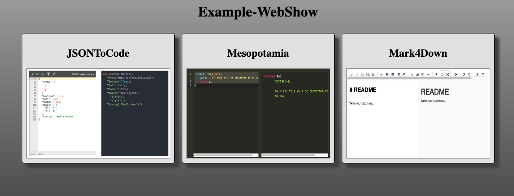

# Example Web Show

Display thumbnail and link of web servers provided by components



## Components

The components are added using git submodule

### Using [kaluza cli](https://github.com/mesopelagique/kaluza-cli)

```bash
kaluza add mesopelagique/JSONToCode
kaluza add mesopelagique/Mesopotamia
kaluza add mesopelagique/Mark4Down  
kaluza install --no-bin
```

## WebServers?

`WEB Server list` method return web server present in memory. So if a server from a component is not available immediately. 

There is two way
- first your current database (the host) accept to send event (see security panel) and the components implement `On Host Database Event` to create the web server
- or you call methods from component to start or get the server

I use the second one in [WebServerList](Documentations/Methods/WebServerList.md)
